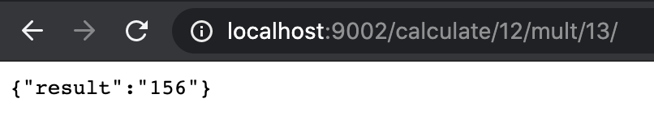

Microservices have become increasingly popular among the organisations because of benefits they offer, A lot of organisations are moving towards Service Oriented Architecture (SOA) and breaking their complex monolithic applications into smaller and modular services which gives a liberty to deploy smaller components of system without having much impact on overall product.
Currently REST is a widely adopted standard for services to communicate with each other, since JSON is a human readable data structure it usually takes more bandwidth and each service has to implement their own serializer for consuming this data.


gRPC is an open source high performance framework developed by Google used for calling remote procedures. It uses HTTP 2.0 for transporting data in the form of bytes instead of JSON. gRPC is language agnostic and it has support for multiple languages which gives an ability to write different services of a system in different languages.

In this blog I’ll give an overview on how you can build an API using gRPC and protobuf.


### Installation

In order to get started with gRPC there are few things that we need to install

- Install protocol buffers compiler, which you can found on this [link](https://developers.google.com/protocol-buffers) or alternatively you can use this [link](http://google.github.io/proto-lens/installing-protoc.html).

- To verify that it's installed correctly, run the following command
 ```
 $ protoc --version
 ```
- Now since we'll be creating services in GoLang we have to fetch the following go packages
 ```
 $ go get -u google.golang.org/grpc
 $ go get -u github.com/golang/protobuf/protoc-gen-go
 ```

### Code

We’ll create a calculator service which takes the input values along with an operation and returns a result. 

Before writing server and client, we first need a contract between client and server which specifies inputs, outputs and methods. We'll create  `calculator.proto` file for this
```
syntax = "proto3";

package calculatorpb;

//A request message which'll take two variables as input
message Request {
    float value1 = 1;
    float value2 = 2;
    string operation = 3;
}

//Response message which contains result of the operation
message Response {
    float result = 1;
}

service Calculator {
    rpc Calculate(Request) returns (Response);
}
```

The above file informs GoLang that how it should encode and decode the data, and the package we installed earlier will help us generate code using this stub.

Next step is to compile this file using `protoc` compiler that we installed earlier. In order to compile this file run the below command 
```
protoc --proto_path=calculatorpb --proto_path=vendors --go_out=plugins=grpc:calculatorpb calculator.proto
```

*Note that I have this `vendors` folder in `proto_path` which includes all files that came with `protoc` compiler. You can create a similar folder and specify the path here in the above command.*

When you run the above command, `calculator.pb.go` file will be created under the same folder

Let's jump to see how the client and server code looks like

#### Server

Server imports the package that we generated earlier from our `proto` file and provides an implementation of the method we specified in the file

```
package main

import (
	"context"
	"errors"
	"grpc-demo/calculatorpb"
	"net"

	"google.golang.org/grpc"
	"google.golang.org/grpc/reflection"
)

type server struct{}

func main() {
	listener, err := net.Listen("tcp", ":3030")
	if err != nil {
		panic(err)
	}

	srv := grpc.NewServer()
	calculatorpb.RegisterCalculatorServer(srv, &server{})
	reflection.Register(srv)

	serverErr := srv.Serve(listener)
	if serverErr != nil {
		panic(err)
	}
}

func (s *server) Calculate(ctx context.Context, request *calculatorpb.Request) (*calculatorpb.Response, error) {
	val1, val2 := request.GetValue1(), request.GetValue2()
	var result float32

	switch request.GetOperation() {
	case "add":
		result = val1 + val2
	case "sub":
		result = val1 - val2
	case "mult":
		result = val1 * val2
	case "div":
		if val2 == 0 {
			return nil, errors.New("division by zero not possible")
		}
		result = val1 / val2
	default:
		return nil, errors.New("operation not found")
	}

	return &calculatorpb.Response{Result: result}, nil
}

```

Now run the below command for server to start listening for requests
```
$ go run server/main.go
```


#### Client

Next we'll create a go-client to initiate a lightweight http server and upon receiving requests from external clients over HTTP it'll parse those requests and invoke the remote method using gRPC client.  

```
package main

import (
	"fmt"
	"grpc-demo/calculatorpb"
	"net/http"
	"strconv"

	"github.com/gin-gonic/gin"
	"google.golang.org/grpc"
)

func main() {
	connection, err := grpc.Dial("localhost:3030", grpc.WithInsecure())
	if err != nil {
		panic(err)
	}

	client := calculatorpb.NewCalculatorClient(connection)

	g := gin.Default()
	g.GET("calculate/:val1/:op/:val2/", func(ctx *gin.Context) {
		val1, err := strconv.ParseFloat(ctx.Param("val1"), 64)
		if err != nil {
			ctx.JSON(http.StatusBadRequest, gin.H{"error": "Invalid Request Paramater val1"})
			return
		}

		val2, err := strconv.ParseFloat(ctx.Param("val2"), 64)
		if err != nil {
			ctx.JSON(http.StatusBadRequest, gin.H{"error": "Invalid Request Paramater val2"})
			return
		}

		req := &calculatorpb.Request{Value1: float32(val1), Value2: float32(val2), Operation: ctx.Param("op")}
		response, err := client.Calculate(ctx, req)
		if err != nil {
			ctx.JSON(http.StatusInternalServerError, gin.H{
				"error": err,
			})
			return
		}

		ctx.JSON(http.StatusOK, gin.H{
			"result": fmt.Sprint(response.Result),
		})
	})

	runErr := g.Run(":9002")
	if runErr != nil {
		fmt.Print("Error running server")
	}
}
```

Now open another terminal window and run same command for your client to start listening http requests on port `:9002`
```
go run go-client/main.go
```

for E2E testing, open your browser and try calling your endpoint with the params like in example below.



I hope the above example will give a basic overview on how to use protobuf and communicate between different services using gRPC. For the complete code you can check this [repo](https://github.com/ashhadsheikh/grpc-demo) and if you have any questions/thoughts/feedback you can reach out via [email](mailto:ashhadsheikh@hotmail.com).